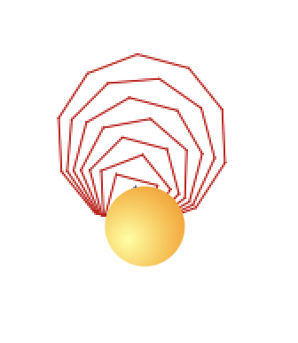

# Chapter 4: Introduction to Programming with Scratch

---

## Section 1: What Is Scratch?

Scratch is a **block-based visual programming language**. Instead of typing code, you drag and snap together colored blocks that represent instructions. The result is a program — the same fundamental thing you'll build in Java.

You've used Scratch in middle school. In this unit, we're using it deliberately: every concept you see in Scratch has a direct equivalent in Java. The goal is not to become a Scratch expert — it's to see the structure of programming before we add Java's syntax on top.

---

## Section 2: Core Programming Concepts in Scratch

### 1. Sequence

Programs run **top to bottom**, one instruction at a time, in order.

In Scratch, blocks in a script execute from the top block down. If you want something to happen first, it goes on top.

---

### 2. Variables

A **variable** is a named container for a value that can change.

In Scratch: use **Make a Variable**, give it a name, and use **set [ ] to** and **change [ ] by** blocks.

---

### 3. Conditionals

A **conditional** runs code only if a condition is true.

In Scratch: `if < > then` and `if < > then / else` blocks.

---

### 4. Loops

A **loop** repeats code multiple times without copy-pasting.

| Scratch block  | description |
|---|---|
| `forever` | code inside repeats endlessly |
| `repeat (10)` | code inside repeats the specified number |
| `repeat until < >` | code inside repeats until the specified condition|

---

### 5. Events

In Scratch, scripts start when something happens — "when green flag clicked", "when key pressed".

---

## Homework

!!! attention
    ### HW 3 — Unit 1 Chapter 4: Interactive Pattern Engine

    You'll build a Scratch program that draws a sequence of regular polygons using pure math — no hardcoded shapes — driven by a loop, a conditional, and a custom block with parameters.

    ### Setup ###
    1. Go to [https://scratch.mit.edu/](https://scratch.mit.edu/) and select Create (no need to make an account).
    2. Change the sprite's costume to a ball (**Costumes** tab, top-left — pick your sprite from the list at the bottom first).
    3. Click **Add Extension** (bottom-left) and add the **Pen** extension — you'll need it to draw.
    
    #### Phase 1: Custom Block — `drawShape`

    1. In the **My Blocks** category, click **Make a Block**. Name it `drawShape`.
    2. Click **Add an input (number or text)** and name the parameter: `sides`
    3. **Add an input (number or text)** again and name the parameter: `length`
    3. Inside the `drawShape` definition:
        - Make a `turnAngle` variable.
        - Set `turnAngle` to the result of `360 / sides`. Hint: use an **Operators** `/` block.
        - Use a `repeat (sides)` loop: move `length` steps, then turn `turnAngle` degrees.
        - Include a **pen down** block somewhere in here — without it, the sprite will move but nothing will actually draw. (Figure out the best place to put it)
    4. Try your block: Add a **when green flag clicked** block and call `drawShape` with test numbers (try 4 sides, length 50 — you should see a square).

    #### Phase 2: Loops & Conditionals

    Update **when green flag clicked** script to do the following:

    1. As your first two instructions, add **erase all** (Pen) and **go to x: 0 y: 0** — this keeps every run starting from a clean stage. 
    - Create a variable named `counter` 
    - Set `counter` to `3`.
    - Use **ask [ ] and wait** (Sensing) to prompt: *"How many sides should the engine build up to?"*
    - Use a `repeat (  )` block that repeats exactly `answer` times — drag the **answer** (Sensing) directly into your `repeat ( )` block; you don't need a separate variable for it.
    5. Inside the `repeat (  )` block:
        - **If** `counter` is less than 5 → set the pen color to blue.
        - **Else** → set the pen color to red.
        - After the if/else, add your `drawShape` block, using inputs `counter` and `counter + 20`.
        - After `drawShape` but still in the `repeat (  )` block, change `counter` by 1.

    #### Phase 3: Run your program to make sure it works!

    Run your engine with a few different inputs. If the user types 8 it should look something like the following:
     
    
     
    What happens as the number of sides grows? Do you ever get blue shapes — why or why not?

    **Reflection** (2–3 sentences, in a comment block in Scratch or the Schoology text box): What was the hardest part of building this, and why?

    **How to submit:** 
    - In Scratch, go to **File → Save to your computer** — this downloads a `.sb3` file. 
    - Upload the `.sb3` to the Schoology assignment. 
