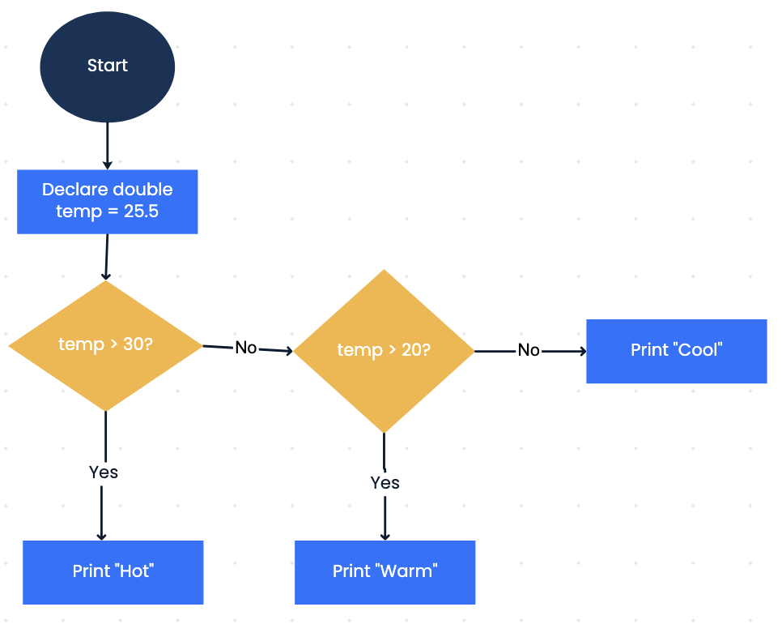
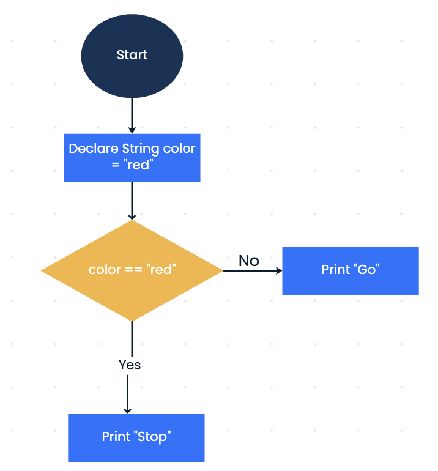
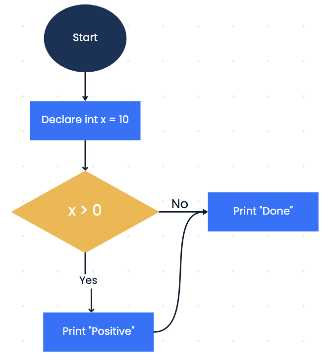
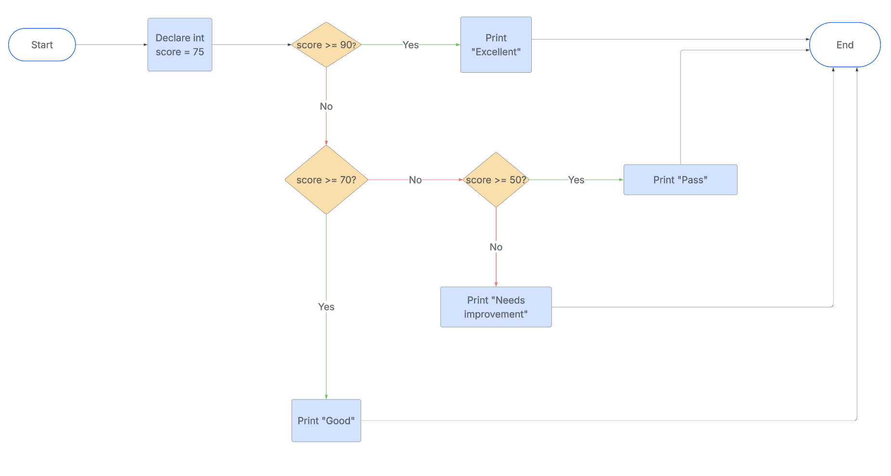

# Chapter 1: Conditional Code Blocks

---

## Section 1: What Is a Conditional Block?

A **conditional block** lets your program decide whether to run certain code based on whether a condition is `true` or `false`. Think of it like a fork in the road — the program chooses one path depending on the situation.

You've already worked with two types of code blocks:
1. **class block** — the outermost block defining a class
2. **main method block** — where our program runs

A conditional block is a third type, nested inside the main method.

---

## Section 2: Comparison Operators

To create conditions, we use **comparison operators**. These compare two values and return either `true` or `false`.

| Operator | Meaning | Example | Result |
|---|---|---|---|
| `<` | less than | `2 < 6` | `true` |
| `>` | greater than | `10 > 5` | `true` |
| `==` | equal to | `10 == 5` | `false` |
| `!=` | not equal to | `7 != 7` | `false` |
| `<=` | less than or equal to | `3 <= 3` | `true` |
| `>=` | greater than or equal to | `4 >= 5` | `false` |

These operators don't return numbers — they return `true` or `false`.

---

## Section 3: The boolean Type

**`boolean`** variables store either `true` or `false`. You can save the result of a comparison:

```java
boolean flag = 2 < 6;   // flag is true because 2 is less than 6
```

Using a boolean can make your code read like a sentence.

---

## Section 4 The `if` Statement

```java
if (condition) {
    // runs only if condition is true
}
```

**Example:**
```java
int age = 17;

if (age >= 18) {
    System.out.println("You are old enough to vote!");
}
System.out.println("Done.");
```

Output for `age = 17`:
```
Done.
```

`17 >= 18` is `false`, so the message is skipped. `"Done."` prints regardless because it's outside the `if` block.

---

## Section 5: The `if` / `else` Statement

`else` runs only if the `if` condition is `false`.

```java
if (age >= 18) {
    System.out.println("You are old enough to vote!");
} else {
    System.out.println("Sorry, you are not old enough to vote.");
}
System.out.println("Done.");
```

Output for `age = 17`:
```
Sorry, you are not old enough to vote.
Done.
```

Only **one** of the `if` or `else` blocks runs — never both.

---

## Section 6: The `else if` Statement

Use `else if` to check multiple conditions in sequence:

```java
int number = 2;

if (number > 0) {
    System.out.println("The number is positive!");
} else if (number == 0) {
    System.out.println("The number is zero.");
} else {
    System.out.println("The number is negative.");
}
```

Java stops at the **first** condition that is `true` and skips the rest. If none are true, the `else` block runs as a catch-all.

---

## Section 7: Logical Operators

Sometimes a decision depends on **more than one** condition. Logical operators combine `boolean` expressions into a single `true`/`false` result.

| Operator | Meaning | Example | True when... |
|---|---|---|---|
| `&&` | AND | `age >= 13 && age <= 19` | **both** sides are true |
| `\|\|` | OR | `day == "Sat" \|\| day == "Sun"` | **at least one** side is true |
| `!` | NOT | `!isRaining` | flips `true` to `false` (or vice versa) |

```java
int num = 50;

if (num >= 1 && num <= 33) {
    System.out.println("Low range");
}

if (num == 50) {
    System.out.println("Exactly fifty!");
}
```

**Key points:**
- `&&` requires **both** conditions to be true — if either is false, the whole expression is false
- `||` requires **at least one** condition to be true — it's only false if both sides are false
- You can combine `&&` with regular comparisons to check ranges, like `num >= 1 && num <= 33`

---

## Section 8: Key Takeaways

- Conditional blocks let your program make decisions
- Conditions use comparison operators to evaluate to `true` or `false`
- `boolean` variables store `true` or `false`
- Only the block whose condition is `true` runs — the others are skipped
- `else if` lets you chain multiple conditions
- `&&`, `||`, and `!` combine conditions together

---

## Unit 3 Chapter 1 Homework

*Complete up to 100 points worth of the exercises below — choose any combination that adds up to no more than 100 points (extra credit beyond 100 is capped). For example: Exercises 1+2+3, or Exercises 1+4.*

- Exercise 1: Match Flowcharts to Code (30 points)
- Exercise 2: Create a Flowchart from Code (30 points)
- Exercise 3: Write Code from a Flowchart (40 points)
- Exercise 4: Create Both Flowchart and Code (70 points)

### Exercise 1: Match Flowcharts to Code (30 points)

Match each flowchart below to the correct code snippet (A, B, or C).







**Code A:**
```java
int x = 10;
if (x > 0) {
    System.out.println("Positive");
}
System.out.println("Done");
```

**Code B:**
```java
double temp = 25.5;
if (temp > 30) {
    System.out.println("Hot");
} else if (temp > 20) {
    System.out.println("Warm");
} else {
    System.out.println("Cool");
}
```

**Code C:**
```java
String color = "red";
if (color.equals("red")) {
    System.out.println("Stop");
} else {
    System.out.println("Go");
}
```
*(Note: Strings are compared with `.equals()`, not `==` — you'll learn more about this later. For now, just read it as "if color is red.")*

Flowchart 1 goes with code snippet: ____
Flowchart 2 goes with code snippet: ____
Flowchart 3 goes with code snippet: ____

### Exercise 2: Create a Flowchart from Code (30 points)

Given the following Java code, draw a corresponding flowchart. Label all shapes clearly and include the exact conditions and actions. Use diamonds for `if` conditions, rectangles for statements (variable declarations, print).

```java
public class AgeChecker {
    public static void main(String[] args) {
        int age = 15;

        if (age >= 18) {
            System.out.println("Adult");
        } else if (age >= 13) {
            System.out.println("Teen");
        } else {
            System.out.println("Child");
        }
    }
}
```

Draw your flowchart on paper and upload a photo, or use drawing software of your choice.

### Exercise 3: Write Code from a Flowchart (40 points)

Read the flowchart below, then write the corresponding Java program. Name the class `ScoreGrader`. Remember to include `public static void main(String[] args)` inside the class. Use appropriate variable types and make sure the code matches the logic exactly.



### Exercise 4: Create Both Flowchart and Code (70 points)

Draw a detailed flowchart for the algorithm below (draw on paper and upload a photo, or use a graphics program), and write the corresponding Java program. Name the class `DiscountCalculator`.

**Algorithm:**

- Declare a `double` variable `purchaseAmount` and set it to `150.0`
- If `purchaseAmount >= 200`, apply a 20% discount and print `"Discounted price: [insert calculated value]"`
- Else if `purchaseAmount >= 100`, apply a 10% discount and print `"Discounted price: [insert calculated value]"`
- Else, print `"No discount. Price: [insert original value]"`
- Additionally, include an initial check: if `purchaseAmount <= 0`, print `"Invalid amount"` and end without calculating
- Add a final print statement that always runs, like `"Thank you for shopping!"`, and reflect it in your flowchart
