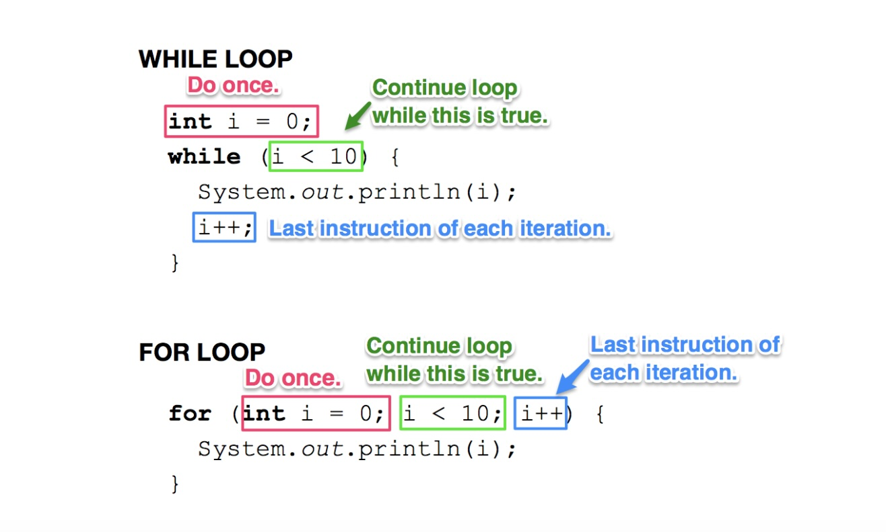

# Chapter 1: For Loops

---

## Section 1: For Loop

A `for` loop is another way to repeat code while a condition is true — just like a `while` loop. The difference is that a `for` loop keeps the **initialization**, **condition**, and **update** all in one line. In a `while` loop, those pieces are spread across separate lines.

**Use a `for` loop** when you know how many times the loop will run.  
**Use a `while` loop** when you're not sure how many iterations you'll need.



**The same loop, two ways:**
```java
// While loop
int i = 0;
while (i < 5) {
    System.out.println(i);
    i++;
}

// For loop — same behavior, more compact
for (int i = 0; i < 5; i++) {
    System.out.println(i);
}
```

---

### Parts of a For Loop

```java
for (initialization; condition; update) {
    // loop body
}
```

| Part | Purpose |
|---|---|
| **Initialization** | Sets the starting value of the loop variable. Runs once before the loop begins. |
| **Condition** | Checked before each iteration. If `true`, loop continues; if `false`, loop exits. |
| **Update** | Runs after each iteration — usually increments or decrements the loop variable. |
| **Loop body** | The code inside the curly braces that runs each iteration. |

---

## Section 2: Code Examples

### Count from 0 to 4
```java
for (int i = 0; i < 5; i++) {
    System.out.println(i);
}
```
Output: `0 1 2 3 4` (one per line)

### Count from 0 to 5 (inclusive)
```java
for (int i = 0; i <= 5; i++) {
    System.out.println(i);
}
```
Output: `0 1 2 3 4 5` — note the `<=` instead of `<`.

### Count down
```java
for (int i = 3; i > 0; i--) {
    System.out.println(i);
}
```
Output: `3 2 1`

---

## Section 3: Why Curly Braces Matter

**With curly braces** — both statements are inside the loop:
```java
for (int i = 0; i < 3; i++) {
    System.out.println(i);
    System.out.println("~~~");
}
```
Output:
```
0
~~~
1
~~~
2
~~~
```

**Without curly braces** — only the first statement is inside the loop:
```java
for (int i = 0; i < 3; i++)
    System.out.println(i);
System.out.println("---");
```
Output:
```
0
1
2
---
```

Always use curly braces. Omitting them is a common source of bugs.

---

## Section 4: Key Vocabulary

| Term | Definition |
|---|---|
| **Increment** | Add to a variable, usually by 1 (`i++` or `i += 1`) |
| **Decrement** | Subtract from a variable, usually by 1 (`i--` or `i -= 1`) |
| **Loop body** | The code inside the loop's curly braces |
| **Iteration** | One complete pass through the loop body |
| **Loop variable** | The variable that controls the loop (usually `i`) |

---

## Homework

!!! attention
    ### HW 10 - Unit 4 Chapter 1: For Loops

    #### Section 1: Vocabulary

    Using these terms, fill in the blanks below with the corresponding definition.:

    - Iteration
    - Loop Variable (or Counter)
    - Initialization
    - Condition
    - Update (or Increment/Decrement)
    - Loop Body

    **Definitions:**

    - __________ A. The part of the loop that sets the starting value, like `int i = 0;`.
    - __________ B. The Boolean expression checked before each iteration, like `i < 10`.
    - __________ C. The code inside the curly braces `{}` that executes repeatedly.
    - __________ D. A single execution of the loop body.
    - __________ E. The statement that changes the loop variable after each iteration, like `i++`.
    - __________ F. The variable that controls the loop, often starting at 0 and increasing.

    #### Section 2: Fill in the Blank

    1. Fill in the missing parts of this for loop, which is intended to run 10 times:
    ```java
    for (__________ = 0; __________ < 10; __________) {
        // code (not shown)
    }
    ```
    2. The `__________` section runs only once at the beginning of the loop.
    3. If the `__________` is false at the start, the loop body won't execute even once.
    4. The `__________` happens at the end of each iteration to modify the loop variable.
    5. For loops are ideal when you know the exact `__________` of times you want to repeat code.
    6. Omitting the curly braces `{}` in a for loop causes only `__________` statement to repeat, instead of a whole block.

    #### Section 3: Free Response Questions

    1. What is the output of the following code?
    ```java
    for (int i = 1; i <= 5; i++) {
        System.out.print(i + " ");
    }
    ```
    2. What happens if you forget the update statement in a for loop?

    #### Section 4: Converting While Loops to For Loops

    Rewrite each while loop below as an equivalent for loop. Keep the behavior identical.

    1.
    ```java
    int count = 0;

    while (count < 10) {
        System.out.println("Hello!");
        count++;
    }
    ```

    2.
    ```java
    int num = 10;

    while (num > 0) {
        System.out.print(num + " ");
        num--;
    }
    ```

    #### Advanced Problems (Not Required, For Extra Practice)

    These are more challenging and may involve nested loops or creative problem-solving. Attempt them if you've mastered the basics above.

    1. Write a for loop that prints the even numbers from 2 to 20 (inclusive).
    2. Re-write this while loop as a for loop:
    ```java
    int sum = 0;
    int i = 1;

    while (i <= 100) {
        sum += i;
        i++;
    }

    System.out.println("Sum: " + sum);
    ```
    3. **(Advanced) Nested Loops for Patterns:** Write a program using nested for loops to print a 5x5 grid of asterisks (`*`):
    ```
    *****
    *****
    *****
    *****
    *****
    ```
    Then modify it to print a right-angled triangle:
    ```
    *
    **
    ***
    ****
    *****
    ```
    4. **Prime Number Checker:** Write a for loop that iterates from 2 to 50 and checks if each number is prime (hint: use a nested loop to test divisibility). Print only the prime numbers.
    5. **Fibonacci Sequence:** Use a for loop to generate and print the first 10 numbers in the Fibonacci sequence (`0, 1, 1, 2, 3, 5, 8, ...`). Start with two variables for the first two numbers.
    6. **Infinite Loop Puzzle:** Intentionally create an infinite for loop (e.g. `for (;;)`), but add a `break` statement inside to exit after 5 iterations. Explain how `break` and `continue` work in for loops, with examples.
